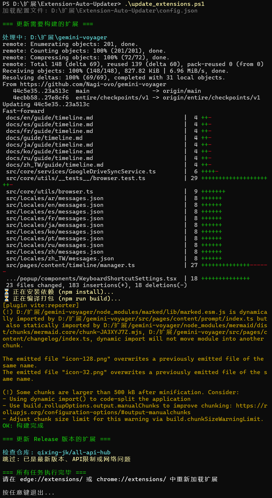
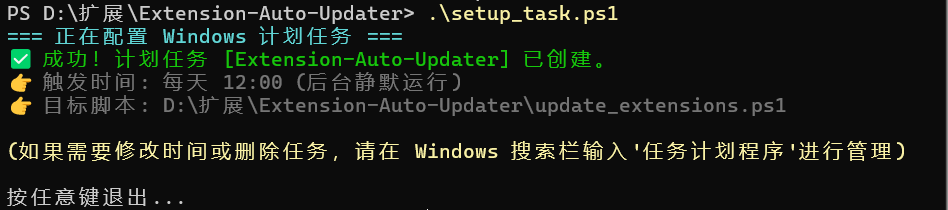

# 🚀 Extension Auto Updater




一个轻量级、零依赖的 Windows PowerShell 工具箱，用于一键自动化更新本地加载的浏览器扩展（Chrome / Edge）。

彻底告别每次都要手动 `git pull`、`npm build`，或者去 GitHub 频繁下载最新 Release 压缩包的繁琐操作。让你的本地开发版扩展永远保持最新！

## ⚠️ 核心警告：防数据丢失必看！
> **在移动扩展文件夹、重命名路径，或者在浏览器中点击“移除”重载之前，请务必阅读此条！**
> 
> 浏览器对本地加载的扩展是**认路径不认人**的。如果你改变了扩展所在的文件夹名称或位置，浏览器会认为这是一个“全新的扩展”并分配新的 ID。这会导致该扩展存储在你电脑上的**所有本地配置和数据瞬间清空**！
> 
> **操作建议：**
> 1. 日常使用本脚本**直接覆盖更新**文件是安全的，不需要在浏览器里移除重载，只需点击扩展卡片上的“刷新”图标即可，数据不会丢失。
> 2. 如果必须更改文件夹路径，请务必先在原扩展内部**导出并备份你的配置文件**！

---

## ✨ 核心特性
- **⚙️ 源码级一键构建**：自动拉取 Git 最新源码，并静默执行 npm 依赖安装与打包。
- **📦 Release 自动抓取**：自动检测并下载解压指定 GitHub 仓库的官方最新版 zip。
- **🛡️ 纯粹的配置解耦**：使用纯 JSON 管理路径，无需修改底层脚本逻辑。
- **🤖 一键注入计划任务**：附带辅助脚本，双击即可配置 Windows 后台每日静默更新，实现全自动化。

## 📁 目录结构
```text
Extension-Auto-Updater/
├── assets/                     # 文档配图
├── .gitignore                  # 防止隐私配置泄露
├── config.example.json         # 🌟 提供给用户的配置模板
├── setup_task.ps1              # 核心：一键配置定时任务的辅助脚本
├── update_extensions.ps1       # 核心：执行拉取与编译的引擎脚本
└── README.md                   # 说明文档
```

## 🛠️ 快速开始

### 1. 准备工作
确保你的电脑已安装 `Git` 和 `Node.js` (仅当你的扩展需要 npm 编译时才需要)。

### 2. 配置路径
1. 将 `config.example.json` 复制一份，并重命名为 `config.json`。
2. 修改 `config.json` 里的路径为你自己的本地扩展存放路径。
   > **注意：** JSON 中的 Windows 路径需使用双反斜杠 `\\` 或正斜杠 `/` 进行转义。

### 3. 运行与自动化
- **手动更新**：右键点击 `update_extensions.ps1`，选择 **使用 PowerShell 运行**。
- **全自动更新**：右键点击 `setup_task.ps1`，选择运行，系统将每天 12:00 在后台静默执行更新。

---

## 🌍 跨设备同步指南 (进阶玩法)

如果你有多台设备（如公司电脑和家里主力机），请参考以下方案同步你的扩展**程序文件**：

### 方案 A：局域网 / P2P 直连同步 (极客首选)
使用 **Syncthing** 等工具，同步 `config.json` 中的扩展目录。只需在主力机上设定自动更新，其他机器自动同步编译好的最新文件。

### 方案 B：云盘漫游 (省心之选)
将本地扩展存放在 OneDrive 或坚果云等同步盘目录下，实现多端代码文件的自动漫游。

> **💡 进阶提示：如何让扩展的“配置数据”也跨设备同步？**
> 本项目同步的仅仅是扩展的“代码文件”。要想连同你在扩展里的设置一起同步：
> 1. 请尽量使用扩展自带的 **云端同步/账号登录** 功能。
> 2. 对于支持 Chrome/Edge 账号自带同步机制的扩展，你需要为本地扩展生成并绑定固定的 `key` (在 manifest.json 中配置)，保证多台电脑上的 Extension ID 一致，浏览器才会为你自动同步配置。
> 3. 否则，请善用扩展内的“导出 JSON 配置”功能。

---

## 🤝 致谢 / Credits
本项目的诞生离不开 AI 助手的深度参与和架构构思。感谢以下“碳基与硅基”共同组成的开发团队：
- **Initiator & Architect**: [483218131] - 提出核心痛点与自动化构想，指出关键的路径陷阱。
- **Co-Author**: [豆包 (Doubao)] - 提供了最初的 Windows 计划任务闭环自动化思路。
- **Co-Author**: [Gemini] - 负责 PowerShell 脚本重构、中文环境乱码攻坚、配置解耦设计及最终文档的撰写。